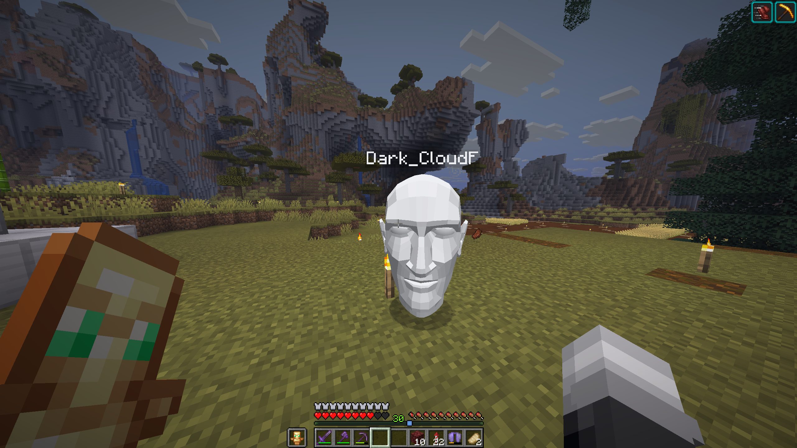

# AllTheTotems

This Fabric Client-Side Mod let's you choose any 3d-Model as your Minecraft Skin.

## Features
- Upload any 3d-Model (in .obj Format) to use as your skin
- Configure settings in the Minecraft Title Screen
- Works on Multiplayer
- Let every Player who uses this Mod see your new skin 

## Constraints
This Mod has some constraints.
NOTHING is moderated and any player who uses it could (theoratically) upload inappropriate content. 

USE AT YOUR OWN RISK.

Any account may be blocked from this service with or without a reason.

The file-size is limited to 5mb to allow for a free use.

Once the server this is hosted on can't take the load anymore, I reserve the right, to shut down the service at any time.

THIS IS SUBJECT TO CHANGE AND MAY BE CHANGED AT ANY TIME.

## Installing
Download it from [GitHub Releases](https://github.com/1TheCrazy/AllTheSkins/releases), [Modrinth](https://modrinth.com/mod/all-the-skins) or [CurseForge](https://www.curseforge.com/minecraft/mc-mods/all-the-skins)

Then place it inside your `mods` folder for Minecraft.

Make sure you have Fabric installed!

## Fabric API
Make sure to include the needed Fabric API.

You can find it on [GitHub](https://github.com/FabricMC/fabric), [CurseForge](https://www.curseforge.com/minecraft/mc-mods/fabric-api), or [Modrinth](https://modrinth.com/mod/fabric-api)

## Screenshots

